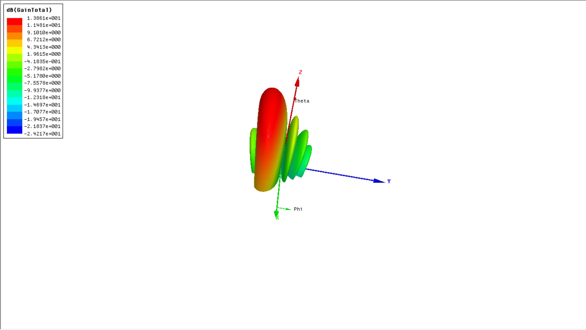
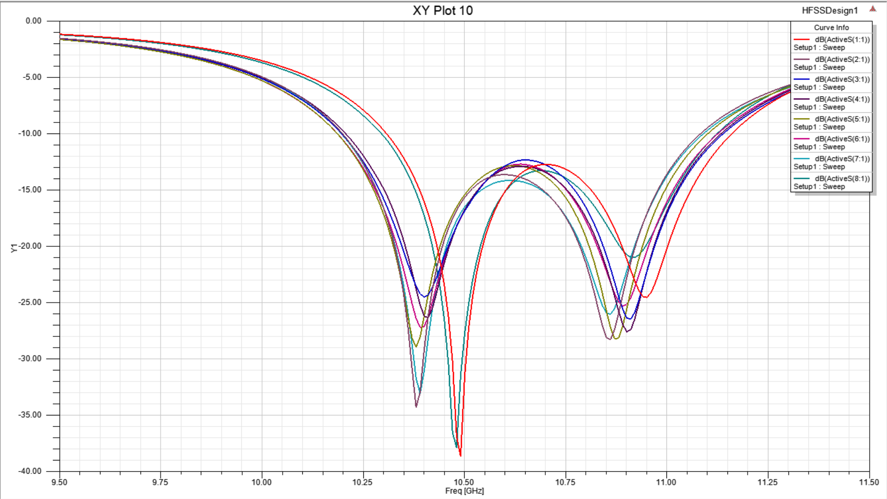
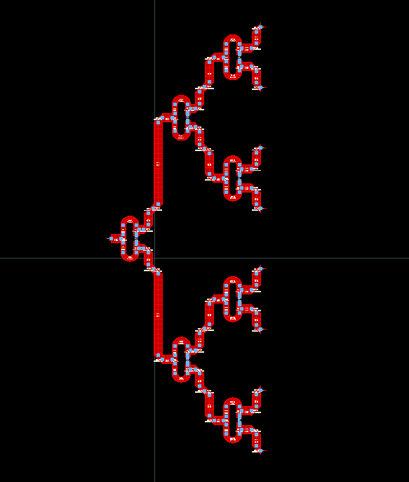

# 10.5 GHz 8-Element Phased Array Antenna System


This repository contains the comprehensive design, simulation, and EM co-simulation of a **10.5 GHz 8-Element Phased Array Antenna System** with Circular Polarization. The project successfully integrates an advanced radiation subsystem (antenna array) with a complex feed network (power divider and electronic phase shifters) without the need for mechanical rotation.

## 📌 Project Overview
Phased array antennas are the backbone of modern radar systems and 5G/6G Massive MIMO communications. This project demonstrates a step-by-step RF/Microwave engineering workflow:
1. **Radiation Subsystem (Ansys HFSS):** Design of a circularly polarized microstrip patch antenna, expanded into a 3-element and subsequently an 8-element linear array, with precise mutual coupling compensation.
2. **Feed Network Subsystem (Keysight ADS):** Design of a cascaded 1-to-8 Wilkinson power divider and an integrated phase shifter network capable of $45^\circ$, $90^\circ$, and $180^\circ$ phase shifts.
3. **Co-Simulation & Layout EM Analysis:** Validating the entire system by integrating HFSS `sNp` Touchstone files into the ADS schematic and analyzing layout parasitics.

## ✨ Key Technical Specifications
* **Operating Frequency:** 10.5 GHz
* **Substrate:** Rogers RT/duroid 5880 ($\epsilon_r = 2.2$, $h = 20 \text{ mil}$)
* **Array Geometry:** 8 elements with $d = 0.4\lambda_0$ spacing.
* **Radiation Performance:** 
  * Maximum Gain: 14.06 dBi (at $0^\circ$ phase)
  * Side Lobe Level (SLL): > 10 dB margin (Calculated SLL is 13.81 dB)
* **Beam Steering Angles:** Scanning capabilities demonstrated at $\pm18^\circ$ (using $\pm45^\circ$ phase shift) and $\pm37^\circ$ (using $\pm90^\circ$ phase shift).
* **Impedance Matching:** Active $S_{ii} < -10 \text{ dB}$ securely maintained across all ports during beam steering.

## 📊 Results & Radiation Patterns

| Beam Steering (45° Scan) | Active Return Loss (8 Ports) | 1-to-8 Feed Network Layout |
| :---: | :---: | :---: |
|  |  |  |

* **Left:** 3D Radiation pattern showing successful electronic beam steering at 45° phase shift.
* **Middle:** Active $S_{ii}$ parameters demonstrating stable impedance matching across all 8 ports despite mutual coupling.
* **Right:** Electromagnetic layout of the 1-to-8 Wilkinson power divider in ADS.

## 📁 Repository Structure

The repository is organized to separate the RF circuit design from the 3D EM simulation:

```text
├── ADS_Workspace/                         
│   ├── Project_Q1_wrk/                    # Keysight ADS: Power Divider (1-to-2 and 1-to-8) design and layout
│   ├── Project_Q2_wrk/                    # Keysight ADS: Phase Shifter blocks and integrated Beam Steering system
│   └── snp/                               # Touchstone files exported from HFSS
├── HFSS_Project/                          
│   ├── Antenna.hfss                       # Ansys HFSS: Single circularly polarized patch antenna
│   ├── Antenna_3_array.hfss               # Ansys HFSS: 3-element array for mutual coupling analysis
│   └── Antenna_8_array.hfss               # Ansys HFSS: Final 8-element phased array
├── Images/                                # Screenshots for the README
├── 10.5GHz_Phased_Array_Final_Report.pdf  # Complete 20-page comprehensive technical report
└── README.md
```
## 📖 Detailed Report
For an in-depth explanation of mathematical calculations, theoretical proofs (including Active S-parameters and Ludwig-3 polarization), and step-by-step layout EM validations, please refer to the attached PDF report:
**[`10.5GHz_Phased_Array_Final_Report.pdf`](./10.5GHz_Phased_Array_Final_Report.pdf)**

## 🛠️ Software & Tools Used
* **Ansys HFSS (AEDT):** 3D Electromagnetic simulation of the antenna and array.
* **Keysight ADS:** RF circuit design, tuning, and layout EM simulation for the feed network.
* **LaTeX:** Documentation and academic reporting.

## 👥 Authors
* **Moein Yousefinia** 
* **Amin Bohtoei** 

*Sharif University of Technology - Electromagnetics Simulation Laboratory (Spring 2026)*